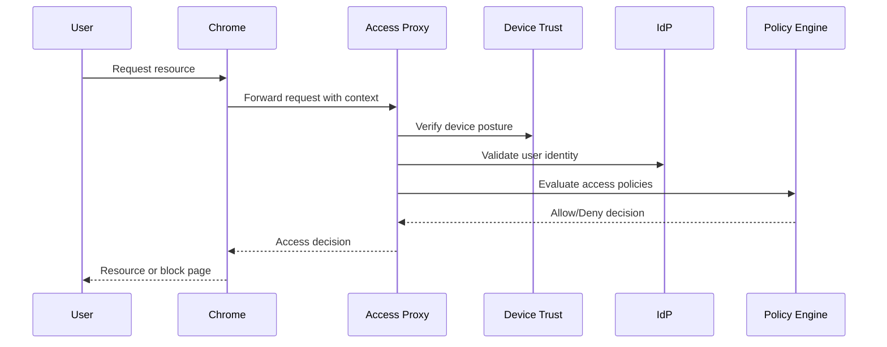

---

layout: default
title: "Chrome Enterprise Context-Aware Access"
description: "Learn how Chrome Enterprise context-aware access works, fromBeyondCorp implementation patterns to zero trust browser security for developers and IT."
date: 2026-03-15
last_modified_at: 2026-04-17
author: "Claude Skills Guide"
permalink: /chrome-enterprise-context-aware-access/
reviewed: true
score: 8
categories: [guides]
tags: [chrome-extension, claude-skills]
geo_optimized: true
sitemap: false
robots: "noindex, nofollow"
---

Context-aware access represents a fundamental shift in how enterprises secure browser-based resources. Instead of relying on traditional perimeter-based security, organizations now evaluate access requests based on multiple contextual factors including user identity, device posture, location, and real-time risk signals. For developers and power users working within enterprise environments, understanding this architecture becomes essential for building compliant applications and troubleshooting access issues.

## What Is Context-Aware Access in Chrome Enterprise

Chrome Enterprise context-aware access builds upon the BeyondCorp principles that Google pioneered internally. The core idea is simple: access decisions should not depend on whether a user connects from within the corporate network, but instead on the trustworthiness of the request itself. This approach eliminates the need for VPN connections for many internal resources and enables zero trust security models.

When a user attempts to access a protected resource through Chrome, the browser communicates with Google's cloud-based access proxy. This proxy evaluates the request against policies defined by your organization. The evaluation considers factors such as:

- User identity: Who is making the request and what groups do they belong to?
- Device security: Does the device meet your organization's security requirements?
- Location: Is the user connecting from an expected geographic region?
- Session context: Are there anomalous signals suggesting credential compromise?

## How the Access Evaluation Works

The technical implementation involves several components working together. The Chrome browser itself acts as the enforcement point, but the actual policy evaluation happens in the cloud. Here's how the pieces connect:



For developers, the most important thing to understand is that this evaluation happens transparently. Your application receives the request just as it would with traditional authentication, but the access control happens before your code ever sees the request.

## Configuring Context-Aware Access Policies

Administrators define context-aware access policies through the Google Admin Console or via Chrome Browser Cloud Management. The policy language allows for granular control over which resources different user groups can access under various conditions.

Here's an example policy configuration that demonstrates the key concepts:

```json
{
 "name": "financial-data-access",
 "description": "Restrict financial data to managed devices",
 "resources": [
 "https://internal.company.com/finance/*"
 ],
 "conditions": {
 "devicePosture": {
 "requireDeviceManagement": true,
 "requireDiskEncryption": true,
 "minimumOsVersion": "14.0"
 },
 "userGroup": ["finance-team", "executives"],
 "ipRanges": ["10.0.0.0/8", "172.16.0.0/12"]
 },
 "action": "ALLOW"
}
```

This policy ensures that only users in specific groups, connecting from expected IP ranges, using devices that meet security requirements, can access financial data. The combination of conditions creates defense in depth.

## Device Posture Verification

One of the most powerful aspects of context-aware access is device posture verification. Chrome Enterprise can verify that devices meet your organization's security standards before granting access. This includes checking:

- Mobile Device Management (MDM) enrollment: Is the device managed by your organization?
- Disk encryption: Is the hard drive encrypted?
- Operating system version: Is the OS up to date with security patches?
- Screen lock: Is the device protected by a password or biometric lock?

For developers testing applications in enterprise environments, device posture requirements can cause unexpected access issues. If you're using an unmanaged personal device or have disabled encryption, you may find that certain resources become inaccessible. Understanding this helps you distinguish between application bugs and access policy restrictions.

## Implementing Application-Level Context Checks

While context-aware access handles authentication and authorization at the infrastructure level, your application may need additional context for fine-grained decisions. Chrome provides extension APIs that expose some context information:

```javascript
// Check if the current context meets certain criteria
chrome.identity.getAuthToken({ interactive: false }, (token) => {
 if (chrome.runtime.lastError) {
 console.log('Authentication required');
 return;
 }
 
 // Token obtained - context-aware access validated user
 fetch('/api/data', {
 headers: { 'Authorization': `Bearer ${token}` }
 });
});
```

The presence of a valid auth token indicates that context-aware access has already validated the user. Your application can trust that the request passed through the appropriate security checks.

## Troubleshooting Access Issues

When users encounter access problems in a context-aware environment, the diagnostic approach differs from traditional network troubleshooting. Here are common scenarios and their solutions:

Symptom: User cannot access an internal application despite valid credentials.

Diagnosis steps:
1. Check if the device is enrolled in your MDM solution
2. Verify the device meets all security posture requirements
3. Confirm the user belongs to the correct access groups
4. Review the access proxy logs in the Admin Console

Symptom: Access works from one network but not another.

Diagnosis: Context-aware access should not depend on network location. If location affects access, check whether IP ranges are incorrectly included in policy conditions. Legitimate geographic changes (user traveling) should not block access if other conditions are satisfied.

## Integration with Existing Identity Providers

Chrome Enterprise context-aware access integrates with major identity providers through standard protocols. Whether you use Azure AD, Okta, Ping Identity, or another IdP, the access proxy can validate credentials and retrieve group membership information.

The integration typically involves:

1. SAML or OIDC federation: Connect your IdP to Google's access proxy
2. Group sync: Import group memberships for policy conditions
3. Attribute mapping: Pass additional user attributes for fine-grained decisions

This integration means you don't need to migrate your identity infrastructure to benefit from context-aware access. The proxy sits in front of your applications, handling the access evaluation while your existing IdP continues managing user identities.

## Performance and User Experience

One concern often raised about cloud-based access proxies is latency. However, Google's infrastructure typically adds only milliseconds to request processing. The trade-off for this minimal overhead includes:

- No need for VPN clients and their associated complexity
- Consistent access experience across locations
- Automatic handling of credential rotation and session management
- Real-time policy enforcement as conditions change

For users, the experience is smooth. They authenticate once through their IdP, and context-aware access handles subsequent requests transparently. If conditions change (device becomes non-compliant), access revokes automatically without requiring manual intervention.

## Practical Considerations for Developers

When building applications for deployment in context-aware environments, consider these practical points:

1. Assume authenticated context: Don't build your own authentication for resources behind access proxies. The proxy handles this.

2. Handle redirects gracefully: Access proxies may redirect to login pages. Ensure your application handles 302 responses correctly.

3. Trust X-headers: The proxy may add headers indicating user identity. Validate these come from your trusted proxy, not from client requests.

4. Test across conditions: Test your application with different device postures and network locations to ensure proper behavior.

Context-aware access fundamentally changes how we think about browser security. By shifting the access decision from network location to contextual trust, organizations can protect their resources while providing better user experiences. For developers, understanding this model helps build applications that work correctly within enterprise security frameworks.

---

---

<div class="mastery-cta">

This took me 3 hours to figure out. I put it in a CLAUDE.md so I'd never figure it out again. Now Claude gets it right on the first try, every project.

16 framework templates. Next.js, FastAPI, Laravel, Rails, Go, Rust, Terraform, and 9 more. Each one 300+ lines of "here's exactly how this stack works." Copy into your project. Done.

**[See the templates →](https://zovo.one/lifetime?utm_source=ccg&utm_medium=cta-config&utm_campaign=chrome-enterprise-context-aware-access)**

$99 once. Yours forever. I keep adding templates monthly.

</div>

Related Reading

- [Chrome Reporting Connector Enterprise: Implementation Guide](/chrome-reporting-connector-enterprise/)
- [Chrome Enterprise Bandwidth Management: A Practical Guide](/chrome-enterprise-bandwidth-management/)
- [Chrome Enterprise Default Printer Policy: A Developer's.](/chrome-enterprise-default-printer-policy/)

Built by theluckystrike. More at [zovo.one](https://zovo.one)


