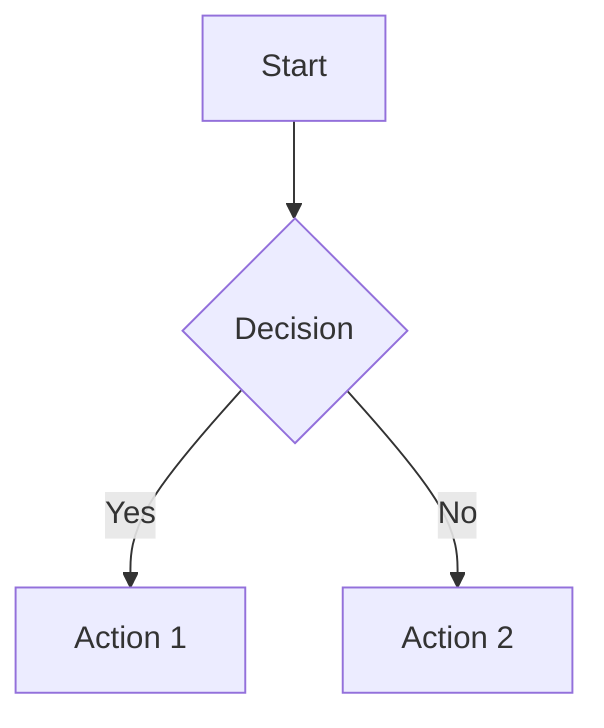
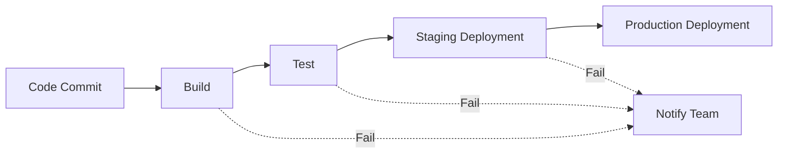
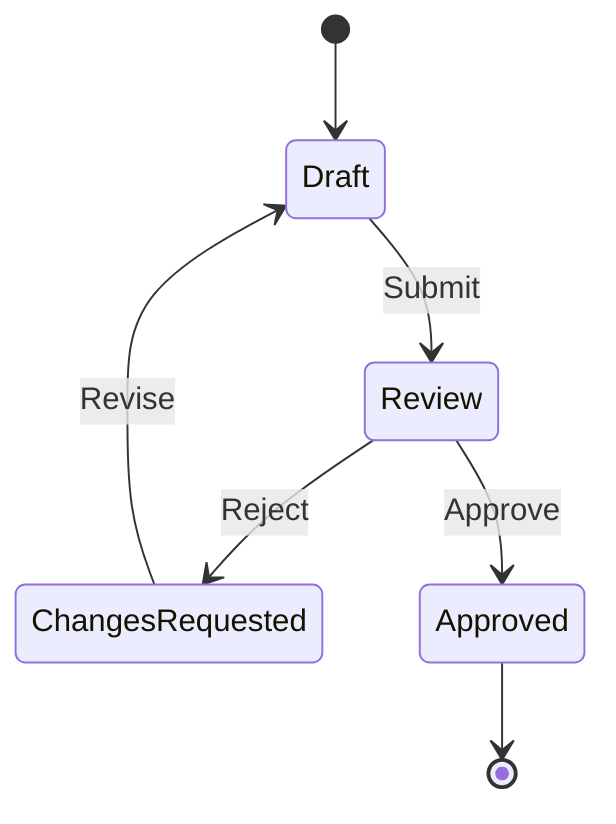
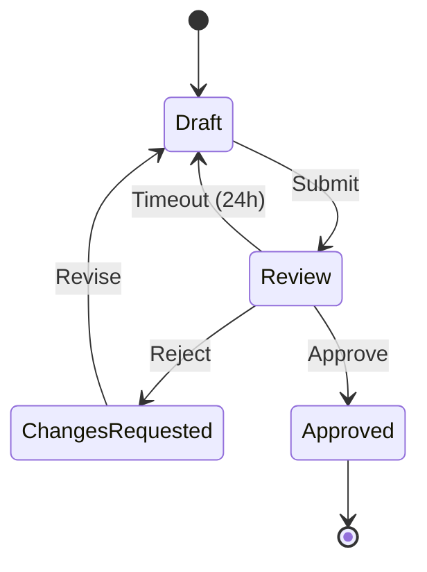
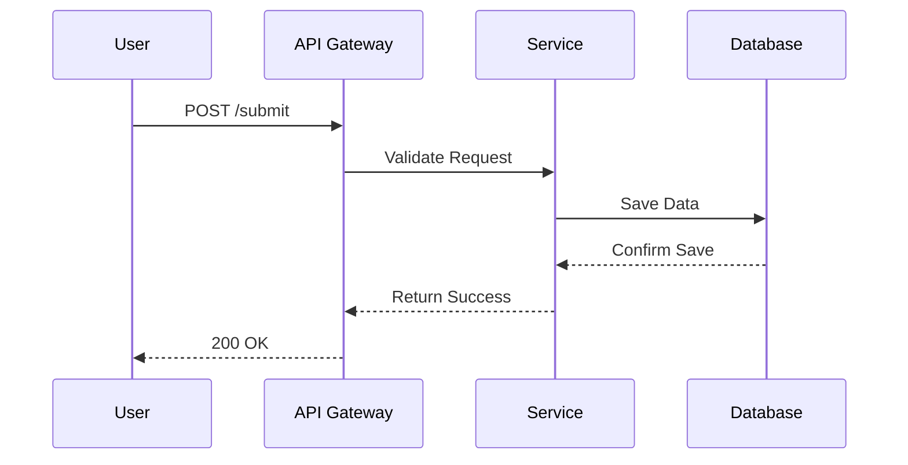
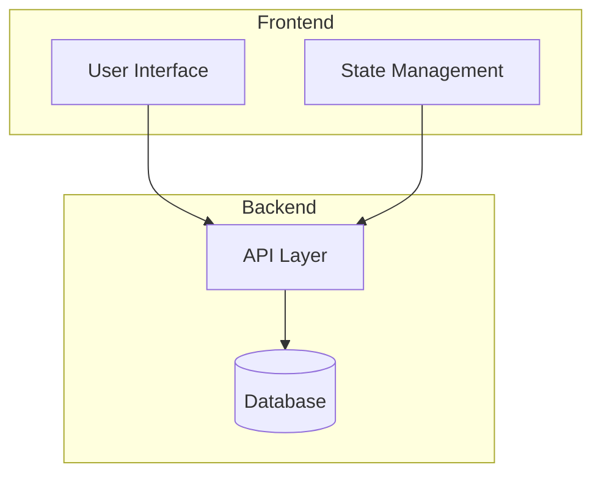

# Claude Code for Diagramming: Mermaid Workflow Guide

Diagramming is an essential part of software development—yet it's often overlooked until you need to explain complex architectures or debug tangled workflows. Claude Code, combined with Mermaid's declarative syntax, offers a powerful workflow for creating, maintaining, and iterating on diagrams as code. This guide shows you how to leverage this combination effectively.

## Why Mermaid with Claude Code?

Mermaid allows you to define diagrams using simple text-based syntax that renders into visual output. When paired with Claude Code, you gain several advantages:

- **Version control friendly**: Diagrams live as code in your repository
- **Iterative refinement**: Describe changes conversationally, let Claude update the syntax
- **Consistency**: Maintain diagram standards across your team's documentation

Claude Code understands Mermaid syntax natively, making it trivial to generate, explain, or modify diagrams through natural language.

## Setting Up Your Diagram Workflow

Before diving into examples, ensure your environment is ready. Create a dedicated directory for your diagrams:

```bash
mkdir -p docs/diagrams
```

You can embed Mermaid diagrams directly in markdown files using the `mermaid` code block syntax:

```markdown

```

## Creating Your First Workflow Diagram

Let's build a practical CI/CD pipeline visualization. Start by describing what you need to Claude:

> "Create a Mermaid diagram showing a CI/CD pipeline with stages: code commit, build, test, staging deployment, and production deployment."

Claude will generate the Mermaid syntax:



Notice the use of `-->` for standard flow and `-.->` for error paths. This distinction helps clarify different workflow branches.

## Advanced Patterns: State Machines and Sequence Diagrams

Beyond simple flowcharts, Mermaid excels at more complex diagram types. Here's how to leverage them effectively with Claude Code.

### State Diagrams for Process Modeling

State machines are ideal for representing entities that transition through defined states:



Ask Claude: "Add a timeout transition from Review back to Draft that triggers after 24 hours"

Claude will update the diagram to include the timeout logic:



### Sequence Diagrams for Interaction Flows

Sequence diagrams clarify how components interact over time:



The `-->>` notation indicates return messages. For complex systems, group actors using `rect` to visualize system boundaries.

## Practical Tips for Diagram Maintenance

### Keep Diagrams Modular

Rather than one massive diagram, create focused diagrams that connect through hyperlinks:

- **Architecture overview**: High-level system boundaries
- **Service details**: Internal workings of each component
- **Data flow**: How information moves between systems

This approach makes diagrams easier to maintain and review.

### Use Subgraphs for Organization

When a diagram grows complex, group related nodes using subgraphs:



### Version Control Best Practices

1. **Commit diagram changes alongside code changes** that they represent
2. **Add descriptive commit messages**: "Update order processing flow to include new validation step"
3. **Review diagram diffs** just like code—Mermaid changes can be subtle

## Integrating with Documentation

To maximize diagram utility, embed them where they'll be seen:

- **README files**: High-level architecture for new contributors
- **ADR documents**: Capture decision context visually
- **Onboarding guides**: Help new team members understand workflows
- **Incident postmortems**: Document what went wrong

Many static site generators (including Jekyll, used by GitHub Pages) render Mermaid diagrams automatically with plugins.

## Common Pitfalls and How to Avoid Them

### Over-Complexity

**Problem**: Diagrams with dozens of nodes become unreadable.

**Solution**: Break into multiple focused diagrams. Claude can help refactor: "Split this into three diagrams: authentication flow, data submission, and error handling."

### Inconsistent Styling

**Problem**: Different diagrams use different conventions.

**Solution**: Establish team conventions:
- Left-to-right for sequential processes (`graph LR`)
- Top-to-bottom for hierarchical structures (`graph TB`)
- Specific colors for error paths vs. happy paths

### Stale Diagrams

**Problem**: Diagrams drift from implementation over time.

**Solution**: Include diagram status in code reviews. Ask: "Does this still match the implementation?"

## Next Steps

Now that you understand the workflow, try these exercises:

1. **Document an existing process**: Take a current workflow and convert it to Mermaid
2. **Create a decision tree**: Model a complex conditional logic as a state diagram
3. **Build an architecture overview**: Visualize your system's major components

Claude Code makes this iterative process natural—describe what you want to change, and let Claude handle the syntax updates.

For more guidance on creating effective Claude Skills that incorporate diagramming workflows, explore the [Claude Skills Guide](/claude-skills-guide/) collection.
