Diagramming is an essential part of software development, yet it's often overlooked until you need to explain complex architectures or debug tangled workflows. Claude Code, combined with Mermaid's declarative syntax, offers a powerful workflow for creating, maintaining, and iterating on diagrams as code. This guide shows you how to use this combination effectively.

Why Mermaid with Claude Code?

Mermaid allows you to define diagrams using simple text-based syntax that renders into visual output. When paired with Claude Code, you gain several advantages:

- Version control friendly: Diagrams live as code in your repository
- Iterative refinement: Describe changes conversationally, let Claude update the syntax
- Consistency: Maintain diagram standards across your team's documentation
- No tool lock-in: Mermaid renders in GitHub, GitLab, Notion, Obsidian, and dozens of other platforms without needing a separate diagramming application

Claude Code understands Mermaid syntax natively, making it trivial to generate, explain, or modify diagrams through natural language. The feedback loop is fast: describe a change, get updated syntax, preview it in a renderer, repeat.

The traditional alternative. pulling up a GUI diagramming tool, dragging shapes, adjusting arrows, exporting an image, committing the image. breaks down over time. Images are binary blobs that don't diff meaningfully in code review, and they fall out of sync with code changes because updating them requires manually reopening the tool. Mermaid diagrams are plain text that can be reviewed, searched, and updated in the same editor you use for code.

## Setting Up Your Diagram Workflow

Before diving into examples, ensure your environment is ready. Create a dedicated directory for your diagrams:

```bash
mkdir -p docs/diagrams
```

You can embed Mermaid diagrams directly in markdown files using the `mermaid` code block syntax:

```markdown
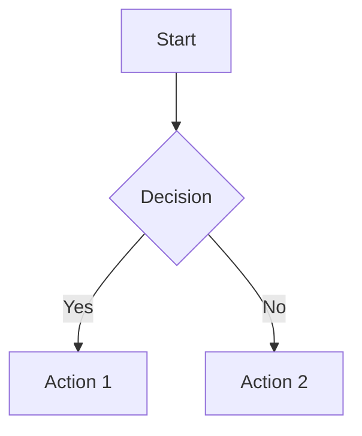
```

For live preview while editing, several options are available depending on your workflow:

- VS Code: Install the "Mermaid Preview" or "Markdown Preview Mermaid Support" extension. Open a markdown file with a mermaid block and trigger the preview panel.
- GitHub: Any mermaid block in a `.md` file renders automatically in the GitHub UI. Push a draft commit and check the rendered output.
- Mermaid Live Editor: The online editor at `mermaid.live` lets you paste syntax and see the diagram instantly. Useful for experimentation before committing.
- CLI rendering: The `@mermaid-js/mermaid-cli` package provides a `mmdc` command that renders diagrams to PNG or SVG, useful for CI pipelines that generate documentation artifacts.

Decide early whether diagrams will live inline in markdown files (simpler, co-located with prose) or as standalone `.mmd` files (easier to reference from multiple places). Standalone files work well when the same diagram appears in multiple documents.

## Creating Your First Workflow Diagram

Let's build a practical CI/CD pipeline visualization. Start by describing what you need to Claude:

> "Create a Mermaid diagram showing a CI/CD pipeline with stages: code commit, build, test, staging deployment, and production deployment."

Claude will generate the Mermaid syntax:

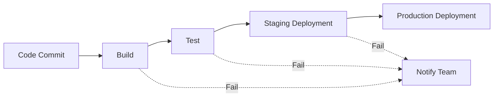

Notice the use of `-->` for standard flow and `-.->` for error paths. This distinction helps clarify different workflow branches.

From here you can iterate conversationally. Ask Claude: "Add a manual approval gate between staging and production." The diagram expands:

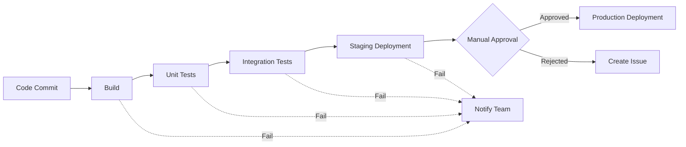

Each iteration is a natural-language request. You are not learning Mermaid syntax deeply. you are describing intent and refining the output. Over time you will pick up the syntax naturally, which lets you make small edits directly without involving Claude for every change.

## Advanced Patterns: State Machines and Sequence Diagrams

Beyond simple flowcharts, Mermaid excels at more complex diagram types. Here's how to use them effectively with Claude Code.

## State Diagrams for Process Modeling

State machines are ideal for representing entities that transition through defined states:

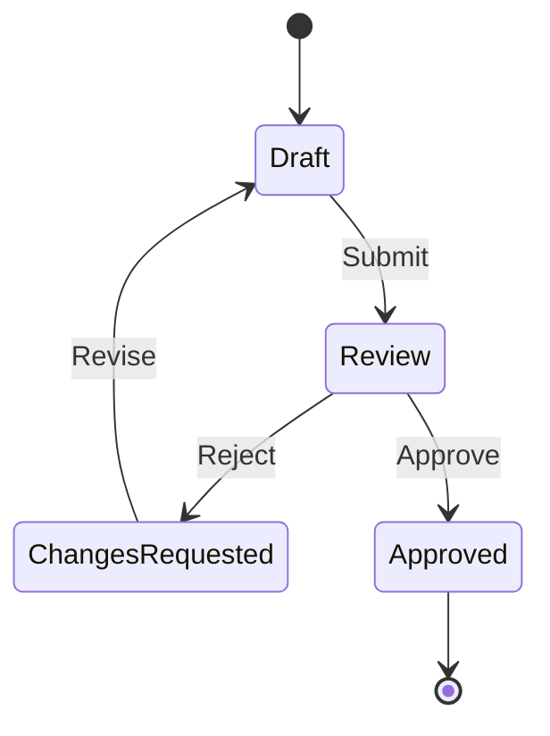

Ask Claude: "Add a timeout transition from Review back to Draft that triggers after 24 hours"

Claude will update the diagram to include the timeout logic:

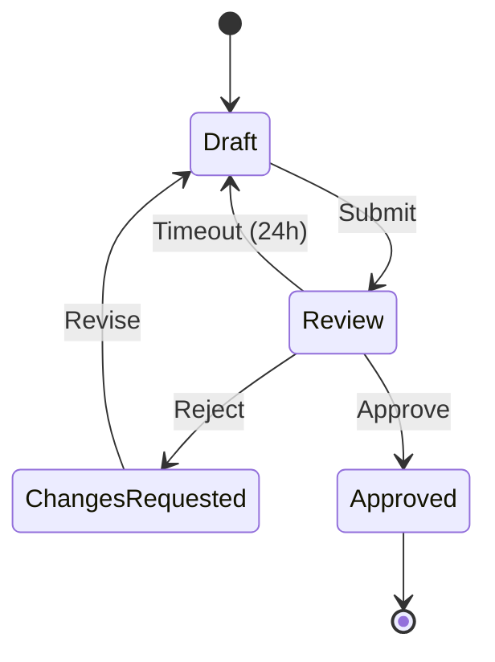

State diagrams are particularly valuable for documenting business objects whose lifecycle is complex. Order statuses, support tickets, subscription states, and document approval workflows all benefit from this treatment. The diagram becomes executable specification: when a developer asks "can an order go from Cancelled back to Processing?", the state diagram gives a definitive answer.

When modeling state machines in code, you can derive the diagram directly from your implementation. If your application uses a state machine library, paste the transition definitions to Claude and ask it to generate the equivalent Mermaid diagram. This keeps documentation in sync with implementation.

## Sequence Diagrams for Interaction Flows

Sequence diagrams clarify how components interact over time:

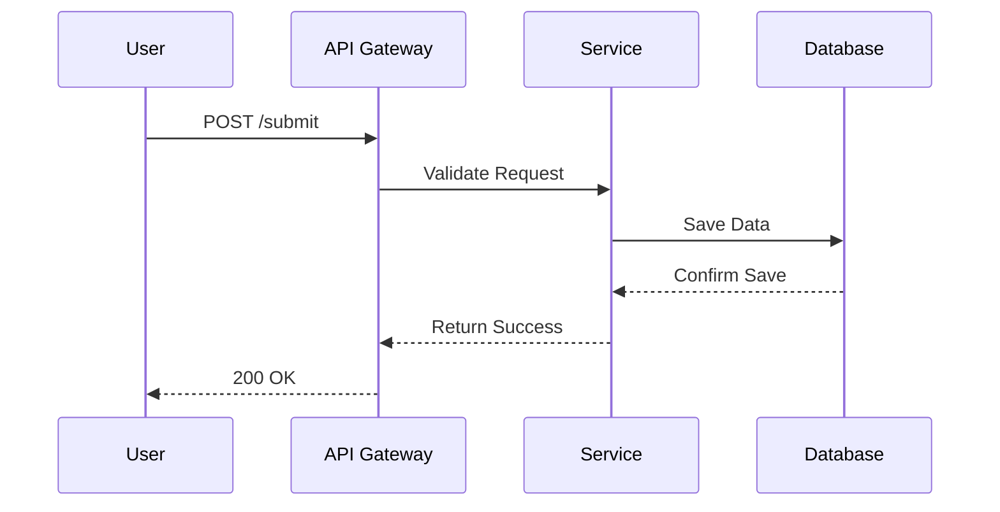

The `-->>` notation indicates return messages. For complex systems, group actors using `rect` to visualize system boundaries.

Sequence diagrams shine when debugging or documenting distributed systems. For an authentication flow involving a frontend, an API gateway, an identity provider, and a user database, a sequence diagram makes the order of operations and message payloads unambiguous:

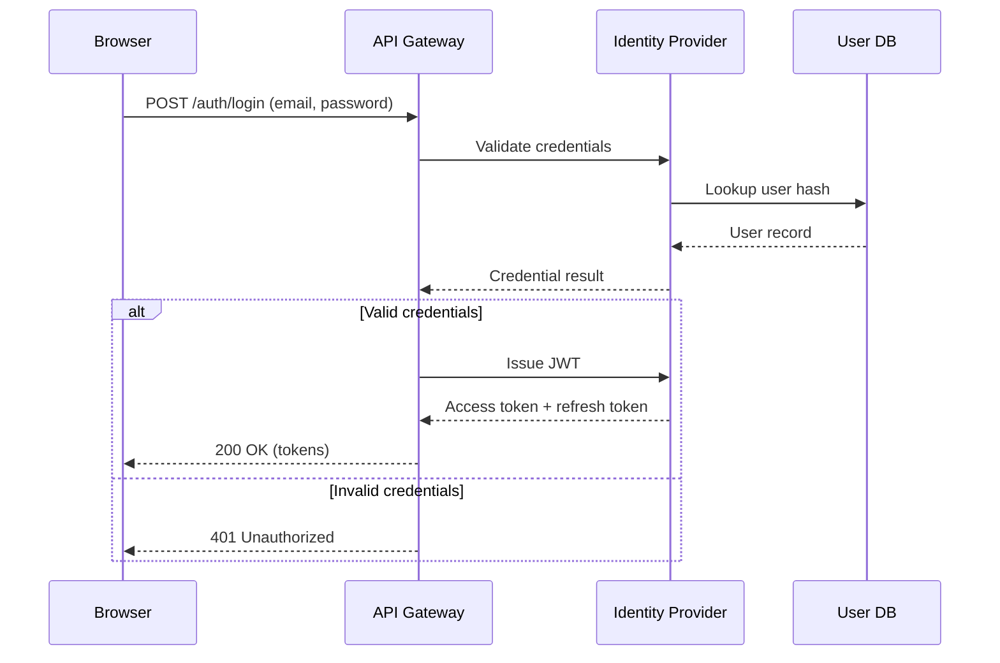

The `alt` / `else` block is one of Mermaid's most useful features for sequence diagrams. it makes conditional paths explicit without needing a separate diagram.

## Entity-Relationship Diagrams for Data Modeling

Mermaid supports ER diagrams, which are useful during schema design and documentation:

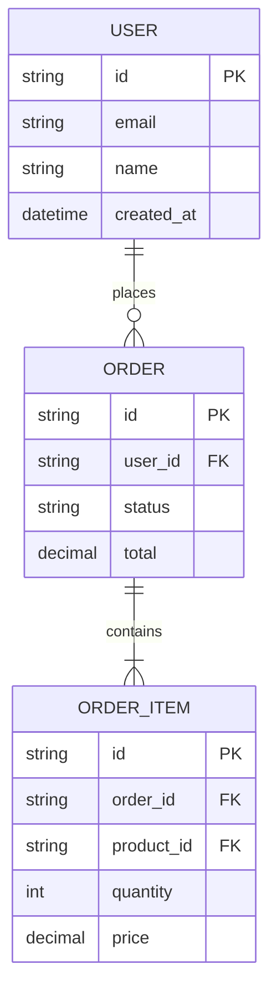

Ask Claude to generate an ER diagram from your database migration files or ORM model definitions. This is faster than drawing it manually and ensures the diagram reflects the actual schema rather than what someone thought the schema was.

## Gantt Charts for Project Timelines

For project planning and milestone tracking, Mermaid's Gantt chart syntax integrates naturally into project documentation:

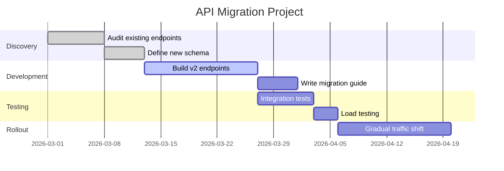

Gantt diagrams kept in your repository next to the project plan give engineers a quick visual reference without context-switching to a project management tool.

## Practical Tips for Diagram Maintenance

## Keep Diagrams Modular

Rather than one massive diagram, create focused diagrams that connect through hyperlinks:

- Architecture overview: High-level system boundaries
- Service details: Internal workings of each component
- Data flow: How information moves between systems

This approach makes diagrams easier to maintain and review.

A monolithic diagram with 40 nodes is difficult to update and nearly impossible to review in a pull request. When diagrams are modular, a change to the order processing service only touches the order service diagram. reviewers can immediately see what changed and whether it matches the code changes in the same PR.

A practical naming convention for diagram files:

```
docs/diagrams/
 overview.md # System-level context diagram
 auth-flow.md # Authentication and authorization
 order-lifecycle.md # Order state transitions
 data-model.md # Core entity relationships
 deployment.md # Infrastructure and deployment
```

## Use Subgraphs for Organization

When a diagram grows complex, group related nodes using subgraphs:

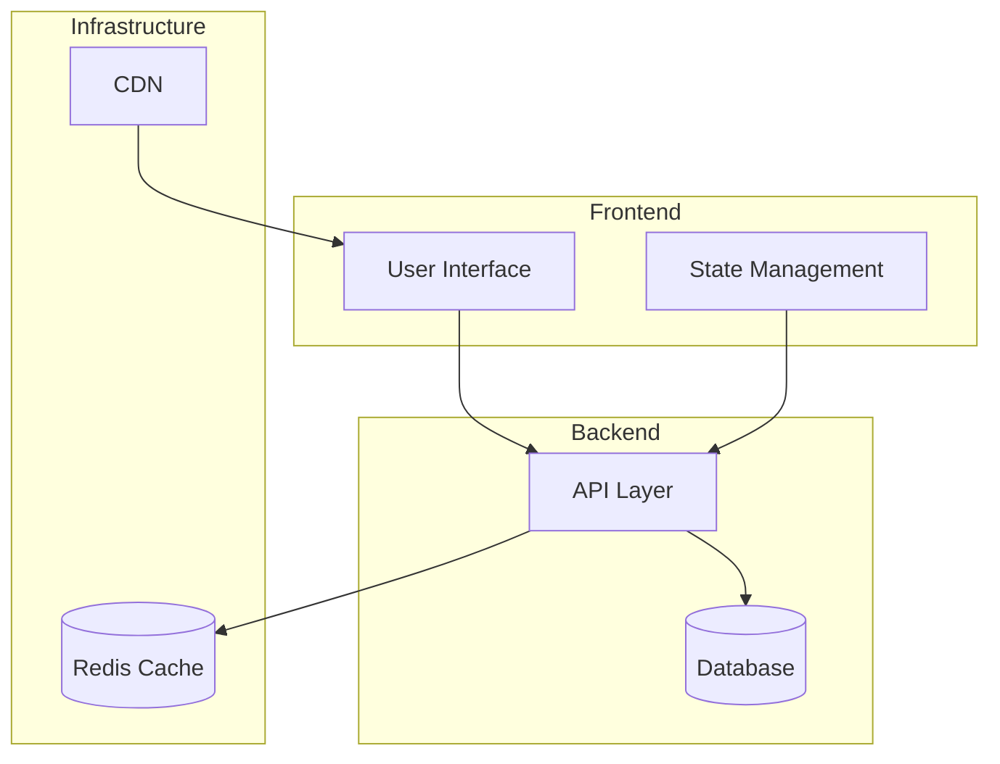

Subgraphs can be styled individually and can also be nested. For microservice architectures, you might have a top-level subgraph per service, with internal nodes showing that service's components.

## Styling Nodes and Edges

Mermaid supports custom styling to make diagrams more readable:

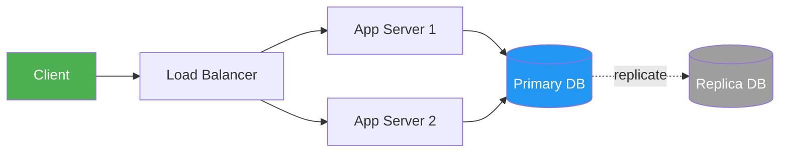

Use color coding consistently: green for entry points, blue for data stores, red for failure paths, grey for deprecated components. Ask Claude to apply your team's color conventions to any new diagram it generates.

## Version Control Best Practices

1. Commit diagram changes alongside code changes that they represent
2. Add descriptive commit messages: "Update order processing flow to include new validation step"
3. Review diagram diffs just like code. Mermaid changes can be subtle
4. Include diagrams in definition of done: if a PR changes a flow, the diagram for that flow must be updated in the same PR

A pre-commit hook that reminds contributors to check diagram currency can help enforce the last point without being overly prescriptive:

```bash
#!/bin/sh
.git/hooks/prepare-commit-msg
If backend files changed, remind about diagrams
if git diff --cached --name-only | grep -q "^src/"; then
 echo ""
 echo "Reminder: If you changed a workflow or data model, update docs/diagrams/ too."
 echo ""
fi
```

## Integrating with Documentation

To maximize diagram utility, embed them where they'll be seen:

- README files: High-level architecture for new contributors
- ADR documents: Capture decision context visually
- Onboarding guides: Help new team members understand workflows
- Incident postmortems: Document what went wrong
- API reference: Sequence diagrams showing request/response flows for complex endpoints

Many static site generators (including Jekyll, used by GitHub Pages) render Mermaid diagrams automatically with plugins.

For Jekyll-based documentation sites, add the Mermaid JavaScript library to your layout file:

```html
<script src="https://cdn.jsdelivr.net/npm/mermaid/dist/mermaid.min.js"></script>
<script>mermaid.initialize({ startOnLoad: true });</script>
```

Then diagrams in your markdown files render automatically in the browser. GitHub renders them natively, so your diagrams are viewable both on the docs site and directly in the repository.

For teams using Notion or Confluence as their primary documentation platform, both support Mermaid blocks. You can maintain the source diagrams in your repository as the source of truth and paste them into Notion when the documentation content requires it.

## Common Pitfalls and How to Avoid Them

## Over-Complexity

Problem: Diagrams with dozens of nodes become unreadable.

Solution: Break into multiple focused diagrams. Claude can help refactor: "Split this into three diagrams: authentication flow, data submission, and error handling."

A diagram should communicate one concept clearly. If you need a legend to explain what nodes mean, or if the diagram requires scrolling to view entirely, it is too large. The goal is not to show everything. it is to show the right things for the audience and context.

## Inconsistent Styling

Problem: Different diagrams use different conventions.

Solution: Establish team conventions:
- Left-to-right for sequential processes (`graph LR`)
- Top-to-bottom for hierarchical structures (`graph TB`)
- Specific colors for error paths vs. happy paths
- Consistent node shapes: rectangles for processes, diamonds for decisions, cylinders for databases

Document these conventions in a short style guide in `docs/diagrams/README.md`. When asking Claude to generate new diagrams, paste the style guide as context and ask it to follow the conventions.

## Stale Diagrams

Problem: Diagrams drift from implementation over time.

Solution: Include diagram status in code reviews. Ask: "Does this still match the implementation?" Treat outdated diagrams as bugs, not cosmetic issues. A diagram that contradicts the actual behavior is actively harmful. it misleads rather than clarifies.

A quarterly diagram review is worthwhile for mature codebases. Ask Claude to read your current codebase and compare it against each diagram, flagging discrepancies. This is faster than manual review and catches subtle drift like renamed services or added dependencies.

## Syntax Errors

Problem: Mermaid syntax is generally forgiving but some edge cases produce silent rendering failures.

Solution: Special characters in node labels must be quoted. Labels containing parentheses, brackets, or pipes need special handling:

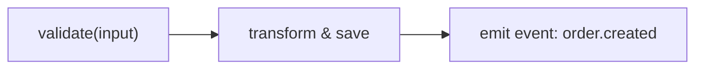

If a diagram renders as blank or broken, ask Claude to check the syntax. It can usually identify the problem node immediately.

## Next Steps

Now that you understand the workflow, try these exercises:

1. Document an existing process: Take a current workflow and convert it to Mermaid. Start with something you already understand well. a deployment process or a user registration flow.
2. Create a decision tree: Model a complex conditional logic as a state diagram. Payment processing, order fulfillment rules, and subscription plan eligibility are good candidates.
3. Build an architecture overview: Visualize your system's major components using a subgraph-organized flowchart. This is the single most valuable diagram for onboarding new team members.
4. Add a diagram to your next PR: The next time you change a workflow, include the diagram update in the same PR. Watch how it changes the code review conversation.

Claude Code makes this iterative process natural. describe what you want to change, and let Claude handle the syntax updates. Over time, the habit of diagramming-as-code changes how you think about documentation: it becomes something you maintain alongside code rather than a separate artifact that quickly becomes outdated.

For more guidance on creating effective Claude Skills that incorporate diagramming workflows, explore the [Claude Skills Guide](/) collection.

---

---

<div class="mastery-cta">

I'm a solo developer in Vietnam. 50K Chrome extension users. $500K+ on Upwork. 5 Claude Max subscriptions running agent fleets in parallel.

These are my actual CLAUDE.md templates, orchestration configs, and prompts. Not a course. Not theory. The files I copy into every project before I write a line of code.

**[See what's inside →](https://zovo.one/lifetime?utm_source=ccg&utm_medium=cta-default&utm_campaign=claude-code-for-diagramming-mermaid-workflow)**

$99 once. Free forever. 47/500 founding spots left.

</div>

Related Reading

- [AI Assisted Architecture Design Workflow Guide](/ai-assisted-architecture-design-workflow-guide/)
- [AI Assisted Code Review Workflow Best Practices](/ai-assisted-code-review-workflow-best-practices/)
- [Best Way to Integrate Claude Code into Team Workflow](/best-way-to-integrate-claude-code-into-team-workflow/)
- [Claude Code for Polygon zkEVM Workflow](/claude-code-for-polygon-zkevm-workflow/)
- [Claude Code for ZenRows Scraping Workflow Tutorial](/claude-code-for-zenrows-scraping-workflow-tutorial/)
- [Claude Code for Kotlin Coroutines Flow Workflow](/claude-code-for-kotlin-coroutines-flow-workflow/)
- [Claude Code For Lemonsqueezy — Complete Developer Guide](/claude-code-for-lemonsqueezy-billing-workflow/)
- [Claude Code for Notion Workflow Tutorial Guide](/claude-code-for-notion-workflow-tutorial-guide/)
- [Claude Code for Wasmtime Runtime Workflow Guide](/claude-code-for-wasmtime-runtime-workflow-guide/)
- [Claude Code for Pandera Dataframe Validation Workflow](/claude-code-for-pandera-dataframe-validation-workflow-tutori/)
- [Claude Code for OpenSSL Certificate Workflow Guide](/claude-code-for-openssl-certificate-workflow-guide/)

Built by theluckystrike. More at [zovo.one](https://zovo.one)


