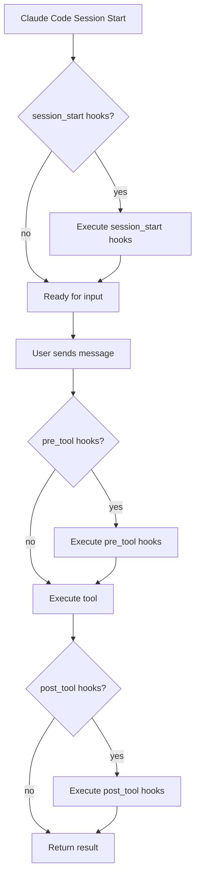

# Claude Howto: Visual Learning Guide (2026)

The `claude-howto` repository by luongnv89 (28K+ stars) teaches Claude Code through visual diagrams and structured learning paths. It uses Mermaid diagrams to explain workflows, provides copy-paste templates for every concept, and packages everything into an 11-13 hour curriculum. EPUB generation lets you read it offline on any e-reader.

## What It Is

A learning-first documentation project that covers Claude Code from installation to advanced multi-agent workflows. Unlike reference documentation that assumes you know what you're looking for, claude-howto follows a structured progression:

1. **Getting Started** — installation, first session, basic commands
2. **Core Concepts** — CLAUDE.md, tools, context management
3. **Intermediate** — hooks, MCP servers, custom commands
4. **Advanced** — multi-agent orchestration, cost optimization, enterprise patterns
5. **Reference** — copy-paste templates for every concept covered

Each section includes Mermaid diagrams that visualize the concept before the text explains it.

## Why It Matters

Claude Code's official documentation is reference-style: accurate but not pedagogical. It tells you what each feature does without explaining when to use it or how it connects to other features.

claude-howto fills that gap. The Mermaid diagrams are particularly effective for visual learners — seeing a workflow as a flowchart before reading the implementation makes the concept stick. The 28K stars suggest this resonates with a large audience.

The EPUB export is a unique feature. Download it to a Kindle or tablet and work through the learning path without a browser.

## Installation

### Browse Online

The simplest approach — read it on GitHub:

```bash
open https://github.com/luongnv89/claude-howto
```

### Clone for Offline Access

```bash
git clone https://github.com/luongnv89/claude-howto.git ~/references/claude-howto
```

### Generate EPUB

```bash
cd ~/references/claude-howto
npm install
npm run build:epub
# Output: ./dist/claude-howto.epub
```

Transfer the EPUB to your e-reader of choice.

## Key Features

1. **Mermaid Diagrams** — visual flowcharts for Claude Code workflows. Session lifecycle, tool selection logic, hook execution order, MCP communication, and multi-agent coordination all have dedicated diagrams.

2. **11-13 Hour Learning Path** — structured progression from beginner to advanced. Each section estimates completion time so you can plan study sessions.

3. **Copy-Paste Templates** — every concept includes a ready-to-use template. CLAUDE.md rules, hook scripts, MCP configs, and command definitions you can paste directly into your project.

4. **EPUB Generation** — export the entire guide as an EPUB for offline reading. Diagrams render as static images in the EPUB.

5. **Progressive Complexity** — starts with "what is Claude Code" and ends with multi-agent orchestration patterns. No assumed knowledge.

6. **Real-World Examples** — examples use realistic codebases (e-commerce API, React dashboard, CLI tool) rather than abstract foo/bar demos.

7. **Exercise Sections** — practice tasks at the end of each chapter. "Configure a hook that runs ESLint on save" or "Set up MCP with a local PostgreSQL database."

8. **Version-Tagged Content** — chapters tagged with the Claude Code version they were written for. Outdated sections are flagged with update notes.

## Real Usage Example

### Visual Learning: Hook Execution Flow

Instead of reading paragraphs about hooks, claude-howto starts with a Mermaid diagram:



Then the text explains each node with a corresponding template:

```bash
# session_start hook — update local docs
#!/bin/bash
cd ~/.claude/docs && git pull --quiet 2>/dev/null || true
```

```bash
# pre_tool hook — log all tool calls
#!/bin/bash
echo "$(date) | $TOOL_NAME | $TOOL_INPUT" >> ~/.claude/tool-log.txt
```

### Copy-Paste CLAUDE.md Template

The CLAUDE.md chapter provides a production-ready template:

```markdown
# Project: [name]

## Tech Stack
- Language: [TypeScript/Python/Go/etc.]
- Framework: [Next.js/FastAPI/etc.]
- Database: [PostgreSQL/MongoDB/etc.]
- Testing: [Vitest/pytest/etc.]

## Behavioral Rules
- Read existing code before modifying files
- Run tests after every code change
- Ask before making architectural decisions
- Keep changes minimal and focused

## Code Standards
- [specific standards for your stack]

## Project Structure
- src/: source code
- tests/: test files
- docs/: documentation
```

## When To Use

- **Learning Claude Code from scratch** — the structured path eliminates "where do I start?" paralysis
- **Visual learners** — the Mermaid diagrams explain concepts faster than text for many people
- **Onboarding team members** — share the guide as pre-reading before giving someone Claude Code access
- **Offline study** — the EPUB export works on any e-reader, no internet needed
- **Quick reference** — the copy-paste templates make it useful even after you've completed the learning path

## When NOT To Use

- **Experienced Claude Code users** — if you're already comfortable with hooks, MCP, and multi-agent patterns, this covers ground you already know
- **Looking for specific API docs** — this is a learning guide, not a reference manual; use the [official docs mirror](/claude-code-docs-offline-mirror-guide-2026/) for API details
- **Cutting-edge features** — the guide may lag behind the latest release by a few weeks

## FAQ

### How long does the full learning path take?

11-13 hours at a measured pace. Most developers complete it in 3-4 sittings over a week.

### Are the diagrams accessible?

Mermaid diagrams render as text-based flowcharts in screen readers. The EPUB version includes alt-text descriptions for static diagram images.

### Can I contribute chapters?

Yes. The repo accepts PRs for new chapters, diagram corrections, and template updates. Follow the contribution guide for formatting requirements.

### Does it cover Claude Code Teams/Enterprise?

The advanced section includes enterprise-specific topics like team-wide CLAUDE.md management, cost allocation, and access control patterns.

## Our Take

**8/10.** The best learning resource for Claude Code newcomers. The Mermaid diagrams are a genuine differentiator — no other resource visualizes Claude Code workflows this well. The copy-paste templates save time even for experienced users. Loses points because the 11-13 hour length means many developers won't finish it, and some sections are verbose where a concise reference would serve better. The EPUB export is a nice touch for long-haul flights.

## Related Resources

- [CLAUDE.md Best Practices](/claude-md-best-practices-10-templates-compared-2026/) — advanced CLAUDE.md patterns beyond the guide's templates
- [Claude Code Hooks Explained](/understanding-claude-code-hooks-system-complete-guide/) — deeper dive into the hook system
- [Best Claude Skills for Developers](/best-claude-skills-for-developers-2026/) — tools to install after completing the learning path

## See Also

- [Claude Howto vs Official Docs for Learning (2026)](/claude-howto-vs-official-docs-learning-2026/)
